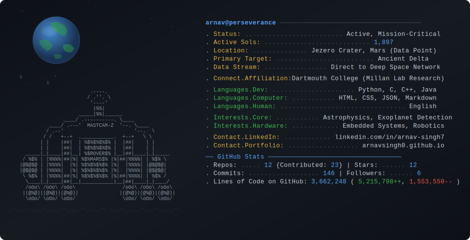

# arnav singh

physics & cs @ dartmouth. 

<!--STARTS_HERE_QUOTE_README-->
<i>❝“On two occasions I have been asked, ‘If you put into the machine wrong figures, will the right answers come out?’  I am not able rightly to apprehend the kind of confusion of ideas that could provoke such a question.”— Charles Babbage   ❞</i>
<!--ENDS_HERE_QUOTE_README-->
Python • C • C++ • Java • React • PostgreSQL • AWS

### / telemetry

  

### / work
[view repositories ↗](https://github.com/arnavsingh0?tab=repositories)
