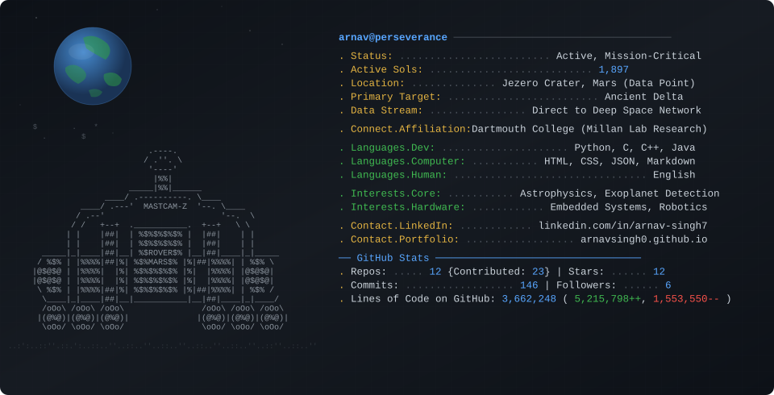

# arnav singh

physics & cs @ dartmouth.

<!--STARTS_HERE_QUOTE_README-->
<i>❝“It’s OK to figure out murder mysteries, but you shouldn’t need to figure out code.  You should be able to read it.”— Steve McConnell   ❞</i>
<!--ENDS_HERE_QUOTE_README-->

  

  <a href="https://github.com/arnavsingh0?tab=repositories">view repositories ↗</a>

