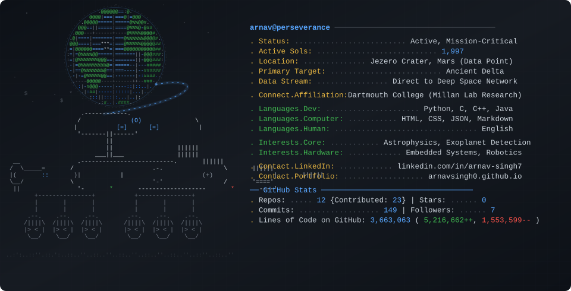

# arnav singh

physics & cs @ dartmouth.

<!--STARTS_HERE_QUOTE_README-->
<i>❝A group of 12 engineers designed IBM PC and they were called as “The Dirty Dozen”.❞</i>
<!--ENDS_HERE_QUOTE_README-->

  

  <a href="https://github.com/arnavsingh0?tab=repositories">view repositories ↗</a>

